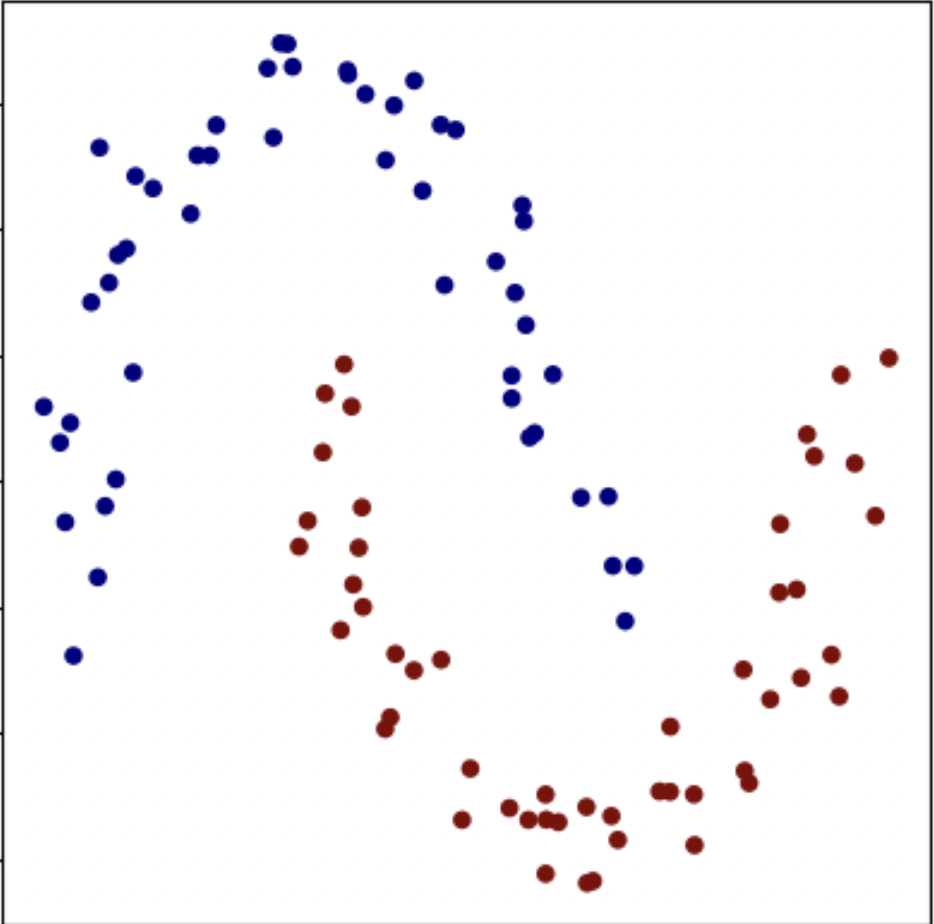

# Intution

This folder exists to **build intuition for how micrograd works internally**.  
While the core repository contains the implementation, this folder explains _why_ that implementation works by walking through the ideas step by step using executable notebooks.

The focus here is understanding, not optimization.

Everything is done with **scalar values**, explicit computation graphs, and direct application of the chain rule, so nothing is hidden from view.

---

## Why This Folder Exists

Backpropagation is often treated as a black box. Frameworks compute gradients automatically, but the reasoning behind them remains invisible.

This folder slows the process down and answers questions like:

- How does a computation graph get created?
- Where do gradients actually come from?
- Why does backpropagation work?
- How do simple scalar operations scale into neural networks?
- What does a trained neural network actually learn in geometric terms?

The notebooks here aim to replace ambiguity with clarity.

---

## What This Folder Contains

This folder contains **four notebooks**, each building on the previous one. They are designed to be followed in order.

Each notebook:

- Introduces new ideas gradually
- Uses explicit code instead of abstractions
- Encourages experimentation and inspection

---

## How to Work Through This Folder

1. Start with `micrograd_basics.ipynb`
2. Move on to `micrograd_intermediate.ipynb`
3. Continue to `micrograd_advanced.ipynb`
4. Finish with `demo.ipynb`

Do not skip ahead. Each notebook assumes understanding of the previous one.

Run the cells sequentially, modify values, and inspect intermediate outputs. The goal is to _see_ how learning happens.

---

## What Each Notebook Does

### `micrograd_basics.ipynb`

This notebook introduces the core idea behind micrograd.

What is covered:

- The `Value` class and what it represents
- How scalar operations create a computational graph (DAG)
- Forward pass: computing values
- Backward pass: computing gradients using the chain rule
- How gradients accumulate at each node

The focus is on **simple expressions and small graphs**, making automatic differentiation easy to reason about.

---

### `micrograd_intermediate.ipynb`

This notebook builds structure on top of the basics.

What is covered:

- Constructing neurons using scalar operations
- Weighted sums and bias terms
- Activation functions
- Combining multiple neurons into small networks

The central idea is composition: how simple scalar operations combine to form neural network components.

---

### `micrograd_advanced.ipynb`

This notebook brings everything together.

What is covered:

- Multi-layer perceptrons (MLPs)
- Loss functions and training loops
- Backpropagation through entire networks
- Visualization of computation graphs
- Observing gradient flow across layers

At this stage, micrograd behaves like a real neural network training system, but with complete transparency.

---

### `demo.ipynb`

This notebook moves from mechanics to behavior.

Instead of inspecting gradients, we now observe what the network _learns_.

What is covered:

- Training an MLP on a non-linear dataset (two moons)
- Mini training loop using stochastic gradient descent
- Margin-based loss with regularization
- Effect of learning rate scheduling
- Visualizing the decision boundary across the input space

Here the neural network stops being an abstract graph and becomes a function that reshapes space.  
You can directly see whether the model has learned structure or memorized points.

---

## Visual Intuition

Moves from mechanics to behavior — the network is trained on a non-linear dataset and we visualize what it learns.

### Raw Dataset (Before Learning)



The classes are not linearly separable.  
No straight line can solve this problem.

---

### Learned Decision Boundary (After Training)


The neural network bends space and discovers a separating curve.  
Learning is visible: the model has captured structure instead of memorizing points.

---

## What You Should Take Away

After completing these notebooks, you should understand:

- How computation graphs are built
- How backpropagation works at a mechanical level
- How gradients flow through neural networks
- How networks transform representations internally
- What learning looks like geometrically

Neural networks may look complex, but they are built from very small, understandable pieces.

---

## How This Folder Fits Into the Repository

- The **core code** shows the implementation
- This folder explains the reasoning behind it
- The demo shows the behavior that emerges from it

Together, they form a complete learning path from

```text
          raw math
             │
             ▼
        DERIVATIVES
             │
             ▼
   scalar operations (Value)
             │
             ▼
          NEURONS
     weighted sums + bias
             │
             ▼
          NETWORKS
     layers + composition
             │
             ▼
        OPTIMIZATION
    loss → gradients → update
             │
             ▼
     LEARNED FUNCTION
  geometry in input space
             │
             ▼
     DECISION BOUNDARY
   behavior you can see
```

---

This folder is meant to be explored, experimented with, and revisited.  
Understanding comes from interaction, not memorization.  
The fastest way to understand is to change things, break them, and observe what happens.
