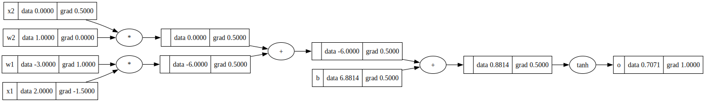

# Visualize

This folder contains scripts to visualize computation graphs generated using the custom `Value` class (micrograd-style automatic differentiation).  
The visualization is generated using **Graphviz**.

---

## Directory Structure

```text
Visualize/
├── __init__.py
├── visualizeGraph.py   # Graph drawing utilities
├── demoVisualize.py  # Demo script
├── computation_graph.svg   # Output (generated)
```

---

## Requirements

### System Dependency

```bash
brew install graphviz
```

### Python Dependency

```bash
pip install graphviz
```

---

## How to Run

Run the demo from the root of the repository:

```bash
python3 -m Visualize.demoVisualize
```

---

## Output

Running the command generates the following file in this folder:

```text
computation_graph.svg
```

This file contains the computation graph with:

- node values (`data`)
- gradients (`grad`)
- operations (`+`, `*`, `tanh`, `ReLU`, etc.)

---

## Viewing the Output

If the file does not open automatically, open it manually:

```bash
open -a "Safari" computation_graph.svg
```

or

```bash
open -a "Google Chrome" computation_graph.svg
```

---

## Result

Below is an example of the generated computation graph:


